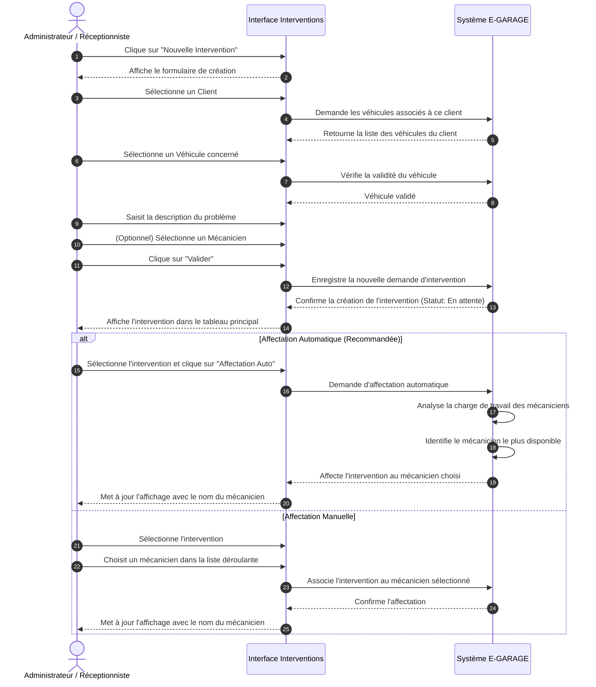

```mermaid
sequenceDiagram
    autonumber
    actor Admin as Administrateur / Réceptionniste
    participant UI as Interface Interventions
    participant Sys as Système E-GARAGE
    
    %% Ouverture du formulaire et sélection du client/véhicule
    Admin->>UI: Clique sur "Nouvelle Intervention"
    UI-->>Admin: Affiche le formulaire de création
    
    Admin->>UI: Sélectionne un Client
    UI->>Sys: Demande les véhicules associés à ce client
    Sys-->>UI: Retourne la liste des véhicules du client
    
    Admin->>UI: Sélectionne un Véhicule concerné
    UI->>Sys: Vérifie la validité du véhicule
    Sys-->>UI: Véhicule validé
    
    %% Saisie des détails et enregistrement
    Admin->>UI: Saisit la description du problème
    Admin->>UI: (Optionnel) Sélectionne un Mécanicien
    Admin->>UI: Clique sur "Valider"
    
    UI->>Sys: Enregistre la nouvelle demande d'intervention
    Sys-->>UI: Confirme la création de l'intervention (Statut: En attente)
    UI-->>Admin: Affiche l'intervention dans le tableau principal
    
    %% Processus d'affectation
    alt Affectation Automatique (Recommandée)
        Admin->>UI: Sélectionne l'intervention et clique sur "Affectation Auto"
        UI->>Sys: Demande d'affectation automatique
        Sys->>Sys: Analyse la charge de travail des mécaniciens
        Sys->>Sys: Identifie le mécanicien le plus disponible
        Sys-->>UI: Affecte l'intervention au mécanicien choisi
        UI-->>Admin: Met à jour l'affichage avec le nom du mécanicien
    else Affectation Manuelle
        Admin->>UI: Sélectionne l'intervention
        Admin->>UI: Choisit un mécanicien dans la liste déroulante
        UI->>Sys: Associe l'intervention au mécanicien sélectionné
        Sys-->>UI: Confirme l'affectation
        UI-->>Admin: Met à jour l'affichage avec le nom du mécanicien
    end
```
